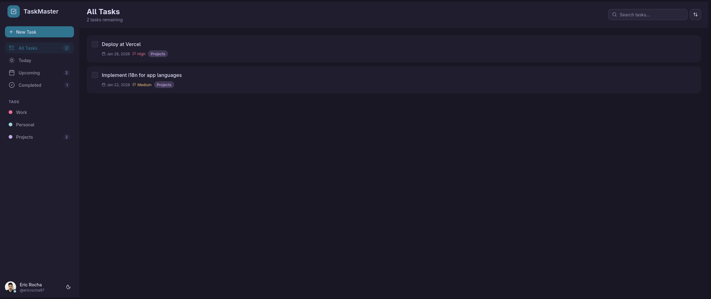
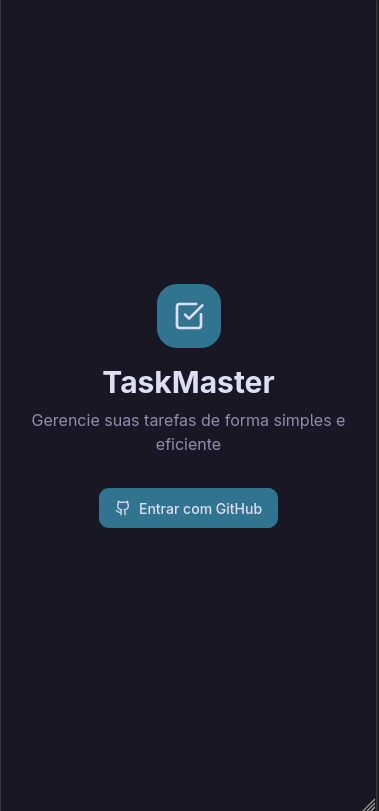

# 📝 To-Do App

> Um aplicativo moderno de gerenciamento de tarefas focado em produtividade e simplicidade.

Bem-vindo ao **To-Do App**, uma solução ágil para organizar seu dia a dia. Desenvolvido com as tecnologias mais recentes do ecossistema React, este projeto oferece uma interface limpa, responsiva e totalmente integrada com serviços em nuvem para garantir que seus dados estejam sempre acessíveis.

## 🚀 Tecnologias e Stack

Este projeto foi construído utilizando uma stack moderna e performática:

- **Core**: [React 19](https://react.dev/) + [TypeScript](https://www.typescriptlang.org/)
- **Build Tool**: [Vite](https://vitejs.dev/)
- **Estilização**: [Tailwind CSS v4](https://tailwindcss.com/) + [shadcn/ui](https://ui.shadcn.com/) (Componentes reutilizáveis)
- **Backend & Auth**: [Firebase](https://firebase.google.com/) (Authentication & Firestore)
- **Ícones**: [Lucide React](https://lucide.dev/)
- **Qualidade de Código**: [Biome](https://biomejs.dev/) & [Ultracite](https://github.com/ultracite/ultracite)

## ✨ Funcionalidades

- **🔐 Autenticação Segura**: Login e registro de usuários via Firebase Authentication.
- **📋 Gestão de Tarefas Completa**: Criar, ler, atualizar e deletar tarefas (CRUD).
- **🏷️ Organização por Tags**: Classifique suas tarefas para melhor visualização.
- **📅 Datas e Prazos**: Defina datas de vencimento para suas atividades.
- **🌗 Dark/Light Mode**: Tema alternável para conforto visual.
- **📱 Design Responsivo**: Funciona perfeitamente em desktop e mobile.

## 📸 Screenshots

### Desktop

<p float="left">
  
  
</p>

### Mobile

<p float="left">
  
  
</p>

## 🛠️ Instalação e Uso

### Pré-requisitos

Certifique-se de ter instalado em sua máquina:

- [Node.js](https://nodejs.org/) (versão LTS recomendada)
- [pnpm](https://pnpm.io/)

### Passo a passo

1. **Clone o repositório**

   ```bash
   git clone https://github.com/ericrocha97/todo-app.git
   cd todo-app
   ```

2. **Instale as dependências**

   ```bash
   pnpm install
   ```

3. **Configure o Firebase**
   - Crie um projeto no console do Firebase.
   - Siga as instruções detalhadas em [`docs/firebase-setup.md`](docs/firebase-setup.md) para configurar as variáveis de ambiente necessárias.

4. **Inicie o servidor de desenvolvimento**

   ```bash
   pnpm dev
   ```

   O aplicativo estará disponível em `http://localhost:5173`.

### Outros Comandos

- **Build para produção**:

  ```bash
  pnpm build
  ```

- **Lint e Formatação**:

  ```bash
  pnpm lint    # Verifica problemas
  pnpm format  # Corrige problemas automaticamente
  ```

## 🤖 Ferramentas de IA Utilizadas

Este projeto é um exemplo de desenvolvimento assistido por Inteligência Artificial, utilizando ferramentas de ponta para acelerar e aprimorar o processo:

| Ferramenta | Propósito no Projeto |
| --- | --- |
| **[Stitch](https://stitch.withgoogle.com/)** | Criação de layout e design system. |
| **[GitHub Copilot](https://github.com/features/copilot)** | Auxílio na descrição de tarefas, documentação e sugestões de código. |
| **[Opencode](https://opencode.ai/)** | Implementação de funcionalidades e lógica de negócios. |

---

Desenvolvido com 💙 e IA.
